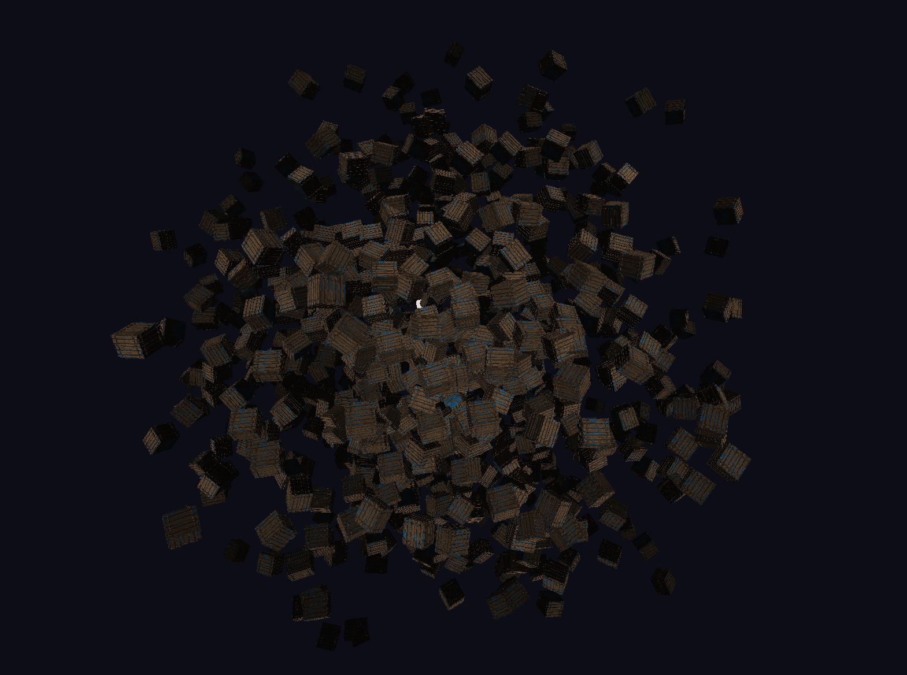

## siren

`siren` is a project I am working on in my spare time. Currently, it has no clear end goal and acts more as a means of
learning for me. It has some game engine as well as rendering engine functionality.

## TODOs

Here is an incomplete list of things I would like to work towards. Many of these points contain a bunch of sub points
that have not been listed.

- [ ] Integrate my ecs engine.
- [ ] Create custom components and systems for the ecs engine
- [ ] Asset management
- [ ] Steady system for rendering various elements regardless of their unique attributes
- [ ] Custom scene format along with serializer and deserializer
- [ ] Finish the 3D Renderer
- [ ] Create a 2D Renderer
- [ ] Make the project Graphics API agnostic, as it is currently solely based on OpenGL
- [ ] Über-Shaders
- [ ] Lighting system
- [ ] Logo for `siren`?
- [ ] Add doxygen documentation (I want to wait until the codebase is more stable)
- [ ] Fetch glad using CMake
- [ ] Caching compiled shaders
- [ ] Define internal Asset format. Asset bundles or something similar
- [ ] Set up AssetManager such that Materials and Textures can also be Assets for the AssetManager
