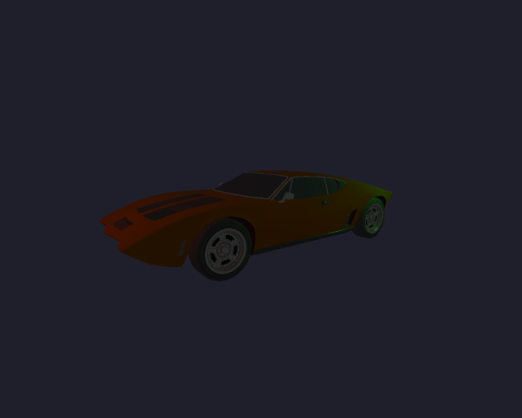

## siren

`siren` is a project I am working on in my spare time. Currently, it has no clear end goal and acts more as a means of
learning for me. It has some game engine as well as rendering engine functionality.

## TODOs

Here is an incomplete list of things I would like to work towards. Many of these points contain a bunch of sub points
that have not been listed.

- [x] Integrate my ecs engine.
- [x] Create custom components and systems for the ecs engine
- [x] Asset management
- [x] Steady system for rendering various elements regardless of their unique attributes
- [ ] Custom scene format along with serializer and deserializer
- [x] Instanced Rendering
- [ ] Finish the 3D Renderer
- [ ] Create a 2D Renderer
- [ ] Make the project Graphics API agnostic, as it is currently solely based on OpenGL
- [ ] Über-Shaders (one basic über shader is done)
- [ ] Lighting system
- [ ] Add doxygen documentation (I want to wait until the codebase is more stable)
- [ ] Fetch glad using CMake
- [ ] Caching compiled shaders
- [ ] Define internal Asset format. Asset bundles or something similar
- [ ] Set up AssetManager such that Textures are also Assets
- [ ] Document importers, make cohesive style (aka only classes, only namespaces)
- [ ] Animation support
- [x] Refactor Buffer file. Create smaller separate files for Vertex Buffer, Vertex Array, Index Buffer etc.
- [x] Go over secs code, might need a refactor
- [ ] Add events to ECS
- [ ] Sparse sets in ECS
- [ ] Archetypes in ECS
